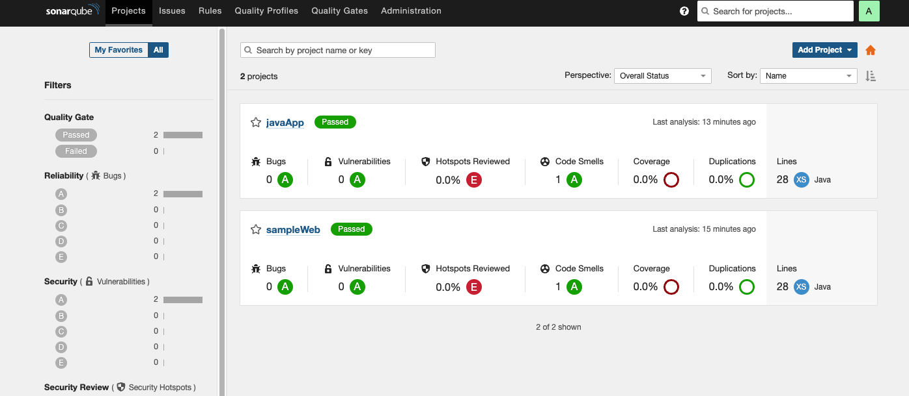

# java_app
This repo is about deploying an Application using Jenkins CI/CD pipeline.
In this demo, an application source code is used to demonstrate a fully functional Jenkins pipeline with some really cool feautures that are used in production workload such as automating installation and configurations, code analaysis, automatic and manual approval in the pipeline, different APIs just as in a microservice app, the use of different servers for different API permits easy load balancing, scalability, availability and most of all easy troubleshooting.

## Structure of the App.

The application structure consist of a Jenkins server which runs the Jenkins CI/CD pipeline that interacts with other APIs of the pipeline such as a kubernetes cluster, a container image registry, a static code analysis API, a version control management/source control management and many more. 

### Pull the application code from github
The pipeline starts by creating a Jenkins pipeline job using Pipeline script from SCM which pulls the application code and run it via the pipeline.

### Code Analysis
The next stage involves scanning the code to remove errors, misconfigurations and also to make sure I can run the code safely. In this stage, the sonarqube plugin is integrated in Jenkins by configuring an environment variable in the pipeline, and a sonarqube token is generated which jenkins will use to authenticate to sonarqube. Also, a webhook is created between jenkins and sonarqube to allow communication between them.

Sonarqube have many rules such as duplications, vulnerability check, security hotspot, reliability, Maintainability Rating, deprecated, functions check amongst others that can be assigned to a quality gate. Once the scanning is complete, the code can either pass or fail the quality gate check. If the code passes the quality gate check, it can move to the next steps but if it fails, it will abort the next steps will not be performed. 

### Containerizing The Application
Once the quality gate is successful, the application is then build and ready for containerization. Before running the application in contaiers, an image of the application have to be created. In this demo, I used docker to create an image of the application by creating a DockerFile with all the necessary steps.
Once the application code have been converted to an image, it needs a repository to be save in. In this demo, I have demonstrated how to use a private repository such as Nexus Repository as well as a public repository such as docker repository to push the image to.

### Setting Up Mail Connectivity
Setting up a notification service for a pipeline is very important as developers, and administrators can recieve instant message about the status of the pipeline at any given time. Also, it may just be a gate for manual approval, just to check and make sure everything is right before deploying the application or giving access to certain resources or next steps in the pipeline. In this demo, a simple email system was setup that once the build is successful, an email should be sent to the admin. In order to configure Email, I downloaded the Email plugin in Jenkins and enter the appropriate parameters to set it up. Once I ran the pipeline, an email was immediately sent to me. 

### Identify Misconfiguration Using Datree Helm plugin.

Kubernetes has so many features that can be configured to suit the best need of a given implementation. This makes it very flexible to use, offering a variety of tools for optimization of a workload. Manually checking all these configurations can sometimes be boring and takes longer, human error during checking or just a step missed. Any error during configuration may lead to a failure in the application which often can take longer to troubleshoot. Sometimes, a misconfiguration can open doors for bugs and hackers into our system and that's very dangerous especially for production workloads. 
That's where Datree comes in. Datree helps to identify misconfiguration from the very start of the project, from development phase all the way to production, scanning the code at each level to check for any misconfiguration. Datree helps to ensure that the project has the right resource requests and limnits to function properly, check the deployment replicas accross availability zones, check and control ports open to the app and outside world, check the host path and provide appropriate permissions and most importantly, automatically enforce best practices on every cluster. 